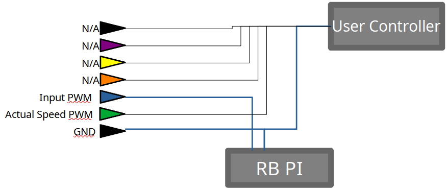
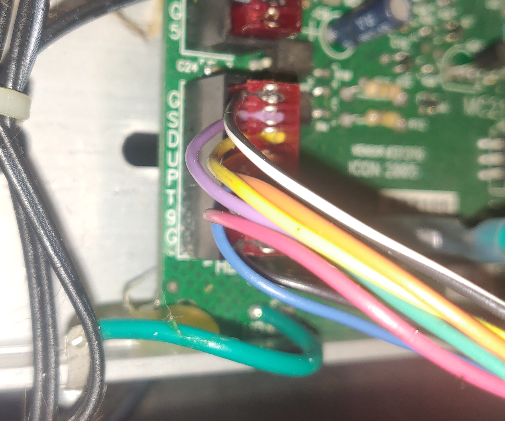

# TreadmillController
Raspberry pi server software for use in controlling the speed of a treadmill remotely.

## Requirements
- Any treadmill with a controller board model MC2100L
- Raspberry Pi with a PWM signal, tested with Raspberry Pi 3
## Setup
There is a header cable connected to the MC2100L board from the user controller (at the top of the treadmill). This must be altered in the following way. The blue wire must be connected to the Raspberry Pi's Positive PWM terminal, while the ground tied to the negative terminal.

The cable looks like this on our device.

## Build & Run
Simply run the following commands in the repo root directory to build and run the program

`$ make`\
`$ ./tread`

## Communicating with the Server
First you must open a connection to the Pi remotely. By default, the hardcoded port is 8003.
Data must be sent as a simple value 0-255. The treadmill controls the speed based on this value sent.
The maximum pulse width the treadmill responds to is 85%, meaning anything over ~212 is not used.
